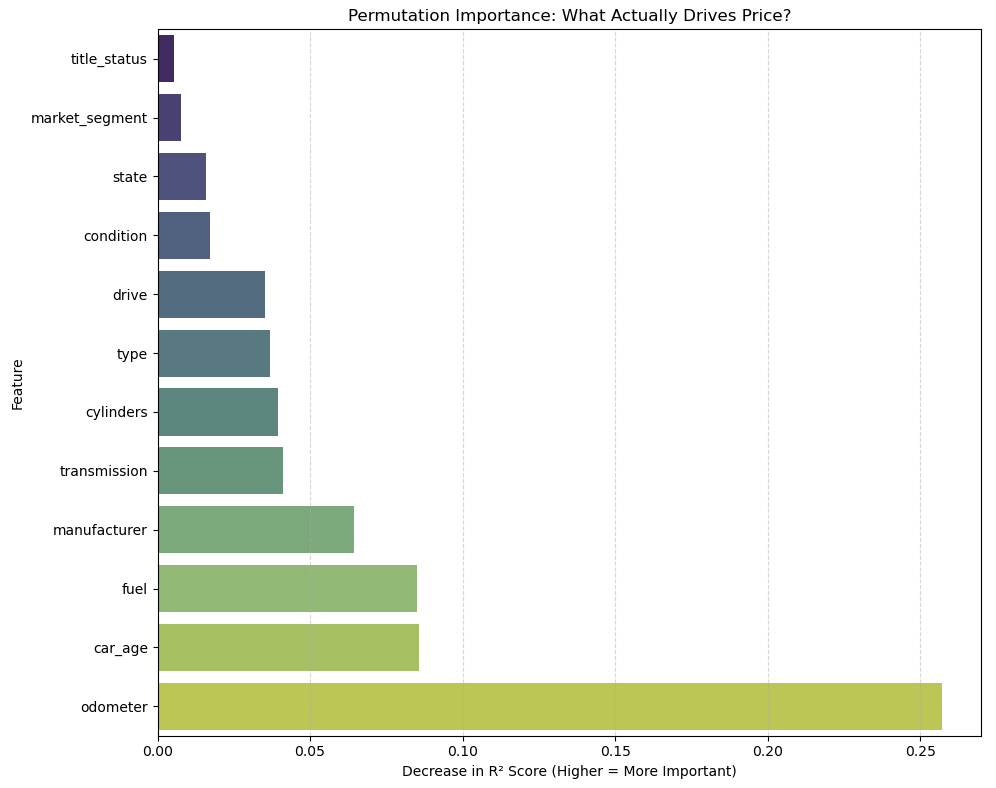
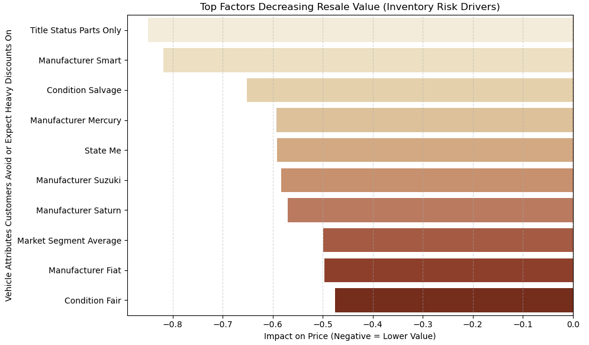

# MODULE_11
<br>
## Project: What Drives the Price of a Car?
<br>
### Executive Summary
In an increasingly competitive used car market, inventory selection and pricing precision are the primary levers of profitability. This report details a comprehensive data analysis of over 426,000 vehicle listings, applying the industry-standard CRISP-DM framework to transform raw market data into a strategic roadmap for inventory management.
<br>
The objective of this analysis was to move beyond intuition-based buying and establish a data-driven approach to maximizing return on investment. The findings identify two critical areas of focus:
<br>
**Profit Drivers**: I isolated the specific vehicle attributes that consistently command price premiums. These insights would enable the purchasing team to maximizes profit.
<br>
**Inventory Risk Assessment**: I quantified the "depreciation anchors"—attributes that act as deterrents to resale value—providing the dealership with clear guidance on high-risk vehicles that should be avoided.
<br>
By aligning the acquisition strategy with these data-driven value drivers, the dealership can significantly reduce market volatility, optimize pricing for every listing and ensure that every dollar spent on inventory results in profit.

---

### Business Understanding
<br><br>
**Project Objectives & Strategic Goals**
The primary goal of this analysis was to move away from guesswork in inventory management and toward a data-driven strategy for maximizing vehicle profitability. By analyzing historical market data, I developed a tool to provide precision pricing and clear inventory guidance.
<br><br>
**The analysis was focused on three strategic outcomes:**
1. **Market Value Prediction**: We utilized historical data to create a reliable "Market Value Predictor." This tool evaluates a vehicle’s specific characteristics to estimate its fair market price, helping the dealership set competitive prices that optimize for both speed-of-sale and profit margin.
2. **Value-Driver Identification**: Rather than treating all car features as equal, we isolated the specific attributes that have the greatest impact on resale value. By quantifying how factors like mileage, age, and condition influence price, we have identified the "Value Drivers" that customers prioritize most.
3. **Inventory Strategy Optimization**: We aimed to translate these technical findings into clear, actionable advice. The objective was to provide the dealership with a roadmap for purchasing decisions—identifying which vehicles to target and which attributes to avoid to minimize financial risk.
<br><br>
**Success Metrics: How Results were Measured**
To ensure this model provides tangible business value, I established the following benchmarks for success:
1. **Pricing Reliability**: The model delivers price estimates within a practical error margin of market listings, providing the sales team with a trustworthy baseline for listing and negotiation.
2. **Strategic Clarity**: We replaced the "black box" approach with transparent insights. The model ranks features by impact, so leadership can clearly understand whether they should be prioritizing mileage over year, or condition over brand reputation.
3. **Project Output**: The final project output is not just a model, but a set of strategic recommendations. I successfully mapped the data insights to concrete actions the dealership can take immediately to improve their inventory mix and profit margins.

---

###CONCLUSION
<br><br>
**1) Primary Drivers of Resale Value (Profit)**
<br>
This analysis indicates the market value is not driven by arbitrary features but by a consistent set of core metrics. Prioritizing these vehicle attributes during the acquisition phase will maximize average resale potential. Here is the list by order of importance:
<br>
- Odometer
- Car Age
- Fuel type
- Manufacturer / Model
- Transmission type
- Cylinders
<br>

*Figure 1: What Drives the Price of a Car High*
<br>
**Recommendation**: Focus on acquisitions with Low-Mileage, Modern-Year, Diesel/Hybrid vehicles. These features act as "multipliers" for your listing price.
<br><br><br>

**2) Inventory Risk Assessment (Avoidance)**
<br>
These are the specific attributes acting as "Depreciation Anchors” (list by order of importance):
<br>
- Title Status Parts Only
- Manufacturer Smart
- Condition Salvage
- Manufacturer Mercury
- Manufacturer Suzuki
<br>

*Figure 1: What Lowers the Price of a Car*
<br>
**Recommendation**: Implement a strict "No-Buy" policy for vehicles with Salvage/Parts-only titles or specific brands identified as high-risk (e.g. Smart, Mercury, Suzuki). These provide a negative ROI.
<br><br><br>

**3) The "Luxury Ceiling" & Operational Caution**
<br>
While our automated pricing model performs with high accuracy for standard inventory, it encounters significant volatility with high-end luxury vehicles (prices > $75k).
<br>
**Operational Insight**: For standard inventory, it is ok to rely on automated pricing tools. For luxury/collector inventory, our analysis shows the market is too fragmented for automated averages. We recommend a different pricing strategy for this segment (needs further exploration).

---

### NEXT STEPS & RECOMMENDATIONS
<br>
Here are some recommendations to ensure this project delivers lasting value
<br>
1) Create a "Buying Cheat Sheet" for the acquisition team using this information
2) Establish specific rules for vehicles valued over $75,000
3) Track every sale for "Actual vs Predicted" to improve model accuracy
4) Continue to explore other models to see if the prediction error can be further reduced and correlation further improved

<br>

---

### Link to the Notebook
You can view the full analysis here: [View Final Analysis Report](./prompt_II.ipynb)

<br>

---

### Repository Structure
```text
├── data/                      # Folder containing the vehicles raw data for this analysis
│   ├── vehicles.csv.zip
├── images/                    # Folder containing main generated plots
│   ├── crisp.png
│   ├── kurt.jpeg
│   ├── What_Actually_Drives_the_Price.png
│   ├── drivers_of_loss2.png
├── prompt_II.ipynb            # Main Jupyter Notebook with Python code
└── README.md                  # Project report and documentation (this file)
